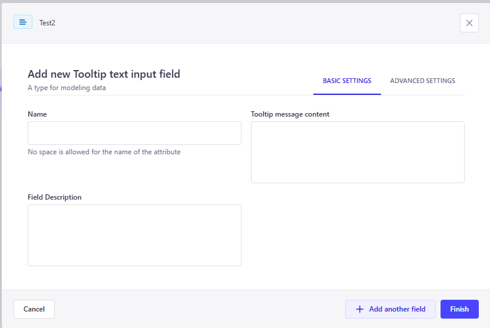
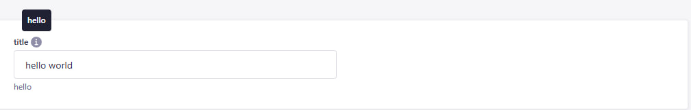

# 🔠 Strapi Superfields Plugin

## Enhance your components with super fields

This plugin adds list of new custom fields in strapi to make the content editing more comfortable

## Added Custom Fields

## 🔗 Navigation

- [Comment Field](#1-comment-field)
- [Tooltip Input Field](#2-tooltip-input-field)
- [Why Use Tooltip Input Field?](#-why-use-tooltip-input-field)
- [Planned Custom Fields](#planned-custom-fields)
- [Issues](#issues)

---

### 1. Comment Field

✔️ Used to leave a comment in admin to inform about something
⚠️ The field is used as private and thus won't appear in api response, it is intended to be used only inside strapiu only

⚙️ Settings

- Name -- name of field
- Comment -- Content of the comment
- Color variant -- The color schema of the comment. Can be green (success), yellow (warn), red (error)

✅ Results this

### 2. Tooltip Input Field

✔️ This custom field allows you to display **tooltips** on input fields directly in the Content Manager.  
🎯 Tooltips help explain the purpose of a field, providing inline documentation and improving content editor usability.  
📌 Especially useful for onboarding editors or when fields require clarification about how values are used.

⚠️ This field is for **editorial use only** — tooltip messages are **not included in the API response**.

---

#### ⚙️ Field Configuration

Tooltip Input Field comes with multiple settings to customize how the help text appears:

- **Name** – The visible label for the field
- **Description** – Optional small text under the input
- **Tooltip message** – The message shown in the tooltip (appears on hover)

---

#### ✅ How It Looks

Below is an example of how a tooltip field appears in the Content Editor:

As you can see:

- The input field has a clear label and description
- A tooltip icon (`ⓘ`) shows contextual help when hovered
- This improves the clarity and usability of your Strapi admin panel

---

#### 🤔 Why Use Tooltip Input Field?

Tooltip Input Field let you:

- Guide editors without taking too much space
- Clarify business rules or formatting
- Improve content accuracy and consistency
- Reduce confusion for complex or optional fields

## Planned custom fields

- ⚪ Tooltiped primitive fields (text, number, boolean) -- To add the description and the
- ⚪ Responsive values -- Allow adding 3 or 5 values for the same input field (base, md, lg) or (base, sm, md, lg, xl). Intended to be used in UI to define the response values.
- ⚪ Color input -- Allow selecting the color from the given list of named color -> hex code enum. Displays the color itself in input in content-editor. Can work in 2 modes: With pre-defined colors list, or with color picker

Feel free to open issues in github to suggest new custom fields

## Issues

All general issues should be submitted through the [Github issue system]
Security issues should be reported using the [security tab]
