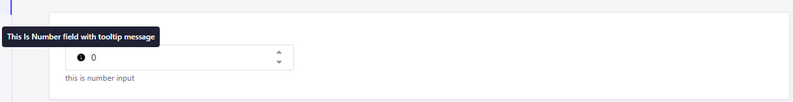
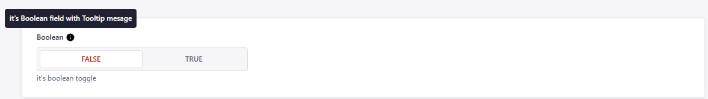

# 🔠 Strapi Superfields Plugin

## Enhance your components with super fields

This plugin adds list of new custom fields in strapi to make the content editing more comfortable

## Added Custom Fields

## 🔗 Fields

- [Comment Field](#1-comment-field)
- [Tooltip Input Field](#2-tooltip-input-field)
- [Tooltip Number Input Field](#3-tooltip-number-input-field)
- [Boolean Field](#4-boolean-field)

---

### 1. Comment Field

✔️ Used to leave a comment in admin to inform about something
⚠️ The field is used as private and thus won't appear in api response, it is intended to be used only inside strapiu only

⚙️ Settings

- Name -- name of field
- Comment -- Content of the comment
- Color variant -- The color schema of the comment. Can be green (success), yellow (warn), red (error)

✅ Results this

### 2. Tooltip Input Field

✔️ This custom field allows you to display **tooltips** on input fields directly in the Content Manager.  
🎯 Tooltips help explain the purpose of a field, providing inline documentation and improving content editor usability.  
📌 Especially useful for onboarding editors or when fields require clarification about how values are used.

⚠️ This field is for **editorial use only** — tooltip messages are **not included in the API response**.

---

#### ⚙️ Field Configuration

Tooltip Input Field comes with multiple settings to customize how the help text appears:

- **Name** – The visible label for the field
- **Description** – Optional small text under the input
- **Tooltip message** – The message shown in the tooltip (appears on hover)

---

#### ✅ How It Looks

Below is an example of how a tooltip field appears in the Content Editor:

As you can see:

- The input field has a clear label and description
- A tooltip icon (`ⓘ`) shows contextual help when hovered
- This improves the clarity and usability of your Strapi admin panel

---

#### 🤔 Why Use Tooltip Input Field?

Tooltip Input Field let you:

- Guide editors without taking too much space
- Clarify business rules or formatting
- Improve content accuracy and consistency
- Reduce confusion for complex or optional fields

### 3. Tooltip Number Input Field

✔️ This custom field allows you to display **tooltips** on number input fields directly in the Content Manager.  
🎯 It helps explain the purpose of a numeric field, providing inline guidance and improving the user experience for content editors.  
📌 Especially useful when fields require specific formats or clarification.

⚠️ This field is for **editorial use only** — tooltip messages are **not included in the API response**.

---

#### ⚙️ Field Configuration

Tooltip Number Input Field provides flexible configuration options:

- **Name** – The name of the field (no spaces allowed)
- **Tooltip message content** – The message shown in the tooltip when hovering the (ℹ️) icon
- **Field Description** – Optional description shown under the input field

---

#### 🧠 Advanced Settings

Advanced options allow further validation and customization:

- **Default Value** – Predefined number to be used as the default input
- **Validation Regex** – Regular expression to validate specific numeric patterns
- **Maximum Length** – Maximum allowed character length for the input
- **Minimum Length** – Minimum character length required
- **Private Field** – Field is hidden from API responses and only visible in the admin panel
- **Required Field** – Field must be filled before submitting the form
- **Unique Field** – Ensures the value is unique across all entries

---

#### ✅ How It Looks

Here is how the Tooltip Number Input Field appears in the Content Editor:

As shown above:

- The field is clearly labeled and displays a helpful tooltip
- A tooltip icon (`ⓘ`) shows contextual help on hover
- An optional description is displayed below the input box
- Default value can be pre-filled

---

#### 🤔 Why Use Tooltip Number Input Field?

Using this field can improve your content editing experience by:

- Providing contextual help for complex numeric fields
- Reducing errors and confusion for content editors
- Supporting validations to enforce rules
- Enhancing usability through better documentation directly in the form

### 4. Boolean Field

✔️ This custom field allows you to add a boolean toggle (yes/no) switch to your content type.  
🎯 It’s useful for binary decisions like enabling/disabling features, flags, or simple true/false statuses.  
📌 Easily integrates into your content editing workflow without writing custom logic.

⚠️ This field supports API visibility control, validation, and advanced toggling logic.

---

#### ⚙️ Field Configuration

Boolean Field includes simple yet effective settings:

- **Name** – The name of the field (used in the API)
- **Label** – Display label in the admin panel
- **Description** – Optional explanation under the toggle
- **Default Value** – Set `true` or `false` as default state

---

#### 🧠 Advanced Settings

Fine-tune your boolean field with advanced options:

- **Default Setting** – Set `true` or `false` or `null` as default state
- **Private Field** – Hidden from API responses
- **Required Field** – Must be explicitly selected
- **Unique Field** – Ensure only one entry can have a specific value

---

#### ✅ How It Looks

Here's how the Boolean Field appears in the Content Editor:

- The toggle appears as a simple switch
- Editors can enable or disable with one click
- Help text and default values improve UX

---

#### 🤔 Why Use Boolean Field?

Boolean Fields help you:

- Add clear yes/no options for editors
- Control feature toggles or flags easily
- Improve editor clarity with description + default value
- Simplify conditional logic in content workflows

## Planned custom fields

- ⚪ Tooltiped primitive fields (text, number, boolean) -- To add the description and the
- ⚪ Responsive values -- Allow adding 3 or 5 values for the same input field (base, md, lg) or (base, sm, md, lg, xl). Intended to be used in UI to define the response values.
- ⚪ Color input -- Allow selecting the color from the given list of named color -> hex code enum. Displays the color itself in input in content-editor. Can work in 2 modes: With pre-defined colors list, or with color picker

Feel free to open issues in github to suggest new custom fields

## Issues

All general issues should be submitted through the [Github issue system]
Security issues should be reported using the [security tab]
